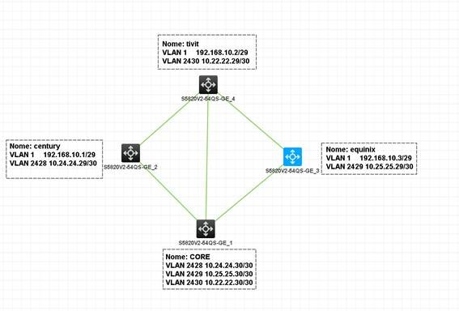

# Início do ambiente de LAB de BGP MED
Neste repositório está hospedado os arquivos de configuração utilizado em cada switch do laboratório.

Esta topologia foi utilizada para testar a aplicação dos parametros de MED e velocidade de link com switch HP.

